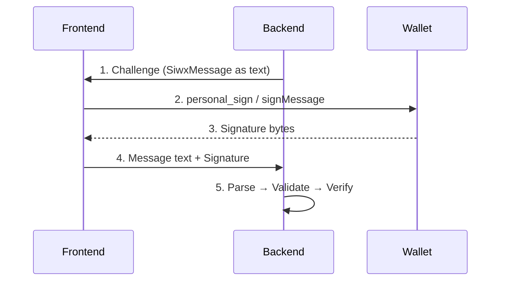

<!-- markdownlint-disable MD033 MD041 MD036 -->

<div align="center">

# Sign In with X

**Chain-Agnostic Wallet Authentication for Rust**

[![CI][ci-badge]][ci-url]
[![License][license-badge]][license-url]
[![Rust][rust-badge]][rust-url]

[ci-badge]: https://github.com/qntx/siwx/actions/workflows/ci.yml/badge.svg
[ci-url]: https://github.com/qntx/siwx/actions/workflows/ci.yml
[license-badge]: https://img.shields.io/badge/license-MIT%2FApache--2.0-blue.svg
[license-url]: LICENSE-MIT
[rust-badge]: https://img.shields.io/badge/rust-edition%202024-orange.svg
[rust-url]: https://doc.rust-lang.org/edition-guide/

Type-safe Rust SDK for [CAIP-122](https://chainagnostic.org/CAIPs/caip-122) Sign-In with X.
Construct, parse, validate, and verify wallet authentication messages across any blockchain.

[Quick Start](#quick-start) | [CLI](#cli) | [Architecture](#architecture) | [API docs][siwx-doc-url]

</div>

## Crates

| Crate | | Description |
| --- | --- | --- |
| **[`siwx`](siwx/)** | [![crates.io][siwx-crate]][siwx-crate-url] [![docs.rs][siwx-doc]][siwx-doc-url] | Core data model, parser, validator, `Verifier` trait |
| **[`siwx-evm`](siwx-evm/)** | [![crates.io][evm-crate]][evm-crate-url] [![docs.rs][evm-doc]][evm-doc-url] | EIP-191 + EIP-1271 verification — Ethereum, Polygon, Arbitrum, … |
| **[`siwx-svm`](siwx-svm/)** | [![crates.io][svm-crate]][svm-crate-url] [![docs.rs][svm-doc]][svm-doc-url] | Ed25519 verification — Solana |
| **[`siwx-cli`](siwx-cli/)** | [![crates.io][cli-crate]][cli-crate-url] | CLI tool for message generation, parsing, and verification |

[siwx-crate]: https://img.shields.io/crates/v/siwx.svg
[siwx-crate-url]: https://crates.io/crates/siwx
[evm-crate]: https://img.shields.io/crates/v/siwx-evm.svg
[evm-crate-url]: https://crates.io/crates/siwx-evm
[svm-crate]: https://img.shields.io/crates/v/siwx-svm.svg
[svm-crate-url]: https://crates.io/crates/siwx-svm
[cli-crate]: https://img.shields.io/crates/v/siwx-cli.svg
[cli-crate-url]: https://crates.io/crates/siwx-cli
[siwx-doc]: https://img.shields.io/docsrs/siwx.svg
[siwx-doc-url]: https://docs.rs/siwx
[evm-doc]: https://img.shields.io/docsrs/siwx-evm.svg
[evm-doc-url]: https://docs.rs/siwx-evm
[svm-doc]: https://img.shields.io/docsrs/siwx-svm.svg
[svm-doc-url]: https://docs.rs/siwx-svm

## Overview

CAIP-122 standardises **wallet-based authentication** across blockchains — the chain-agnostic successor to [EIP-4361 (SIWE)](https://eips.ethereum.org/EIPS/eip-4361). This SDK provides:

- **Message construction** — build CAIP-122 challenge messages with a builder API
- **Message parsing** — round-trip `FromStr` / `Display` for the human-readable signing format
- **Temporal & domain validation** — expiration, not-before, domain binding, nonce binding
- **Signature verification** — pluggable `Verifier` trait (with a `CHAIN_NAME` associated constant) and built-in EVM / Solana implementations
- **CLI tool** — generate, parse, and verify messages from the command line with JSON output

The core `siwx` crate is chain-agnostic; chain-specific logic is in companion crates.

## Quick Start

### Construct message (backend)

```rust
use siwx::{SiwxMessage, Verifier};
use siwx_evm::Eip191Verifier;

let message = SiwxMessage::new(
    "example.com",                                    // domain
    "0xd8dA6BF26964aF9D7eEd9e03E53415D37aA96045",     // address
    "https://example.com/login",                      // uri
    "1",                                              // version
    "1",                                              // chain_id (EIP-155)
)?
.with_statement("Sign in to Example")
.with_nonce(siwx::nonce::generate_default());

// Render into the EIP-4361 signing string via the chain's Verifier.
// `format_message` is a `Verifier` default method — the chain label comes
// from `Eip191Verifier::CHAIN_NAME` ("Ethereum"), so it can never drift.
let signing_input = Eip191Verifier::format_message(&message);
// → "example.com wants you to sign in with your Ethereum account:\n0xd8dA…"
```

### Verify signature (backend)

```rust,no_run
use siwx::{SiwxMessage, ValidateOpts, Verifier};
use siwx_evm::EvmVerifier;

// Inputs (typically supplied by the frontend / session store):
//   signing_input:   String        — the CAIP-122 message text the wallet signed
//   signature_bytes: &[u8]         — raw bytes returned by the wallet
//   expected_nonce:  String        — nonce your backend issued in step 1

// 1. Parse the message text back into a typed value
let message: SiwxMessage = signing_input.parse()?;

// 2. Validate fields & temporal constraints
message.validate(&ValidateOpts {
    domain: Some("example.com".into()),
    nonce:  Some(expected_nonce),
    ..Default::default()
})?;

// 3. Cryptographic verification (EIP-191 first, EIP-1271 fallback via RPC)
let verifier = EvmVerifier::with_rpc("https://eth.llamarpc.com");
verifier.verify(&message, &signature_bytes).await?;
```

## CLI

### Install the CLI

**Shell** (macOS / Linux):

```sh
curl -fsSL https://sh.qntx.fun/siwx | sh
```

**PowerShell** (Windows):

```powershell
irm https://sh.qntx.fun/siwx/ps | iex
```

Or via Cargo:

```bash
cargo install siwx-cli
```

### Generate message

```sh
siwx evm message \
  --domain example.com \
  --address 0xd8dA6BF26964aF9D7eEd9e03E53415D37aA96045 \
  --uri https://example.com/login \
  --chain-id 1 \
  --statement "Sign in to Example"
```

```sh
siwx svm message \
  --domain example.com \
  --address GwAF45zjfyGzUbd3i3hXxzGeuchzEZXwpRYHZM5912F1 \
  --uri https://example.com/login \
  --chain-id 5eykt4UsFv8P8NJdTREpY1vzqKqZKvdpKuc147dw2N9d
```

### Verify signature

```sh
siwx evm verify --message "..." --signature 0x...
siwx svm verify --message "..." --signature 0x...
```

### JSON output

All commands support `--json` for programmatic / agent consumption:

```sh
siwx --json evm message --domain example.com --address 0x... --uri https://... --chain-id 1
```

```json
{
  "chain": "ethereum",
  "message": "example.com wants you to sign in with your Ethereum account:\n...",
  "domain": "example.com",
  "address": "0x...",
  "uri": "https://...",
  "version": "1",
  "chain_id": "1",
  "nonce": "L8s2Mf7kGxPQN9a4z",
  "issued_at": "2024-01-01T00:00:00Z"
}
```

## Architecture

### Authentication Flow



### CAIP-122 Message Format

```text
example.com wants you to sign in with your Ethereum account:
0xd8dA6BF26964aF9D7eEd9e03E53415D37aA96045

Sign in to Example

URI: https://example.com/login
Version: 1
Chain ID: 1
Nonce: L8s2Mf7kGxPQN9a4z
Issued At: 2024-01-01T00:00:00Z
```

### Verifier Trait

Chain-specific crates implement the `Verifier` trait:

```rust
pub trait Verifier: Send + Sync {
    /// Ecosystem label embedded in the CAIP-122 preamble — e.g. "Ethereum",
    /// "Solana". Required, so new chains can never ship without one.
    const CHAIN_NAME: &'static str;

    /// Verify `signature` over `message`.
    fn verify(
        &self,
        message: &SiwxMessage,
        signature: &[u8],
    ) -> impl Future<Output = Result<(), SiwxError>> + Send;

    /// Render `message` into the chain's canonical signing string.
    /// Default impl calls `SiwxMessage::to_sign_string(Self::CHAIN_NAME)`.
    fn format_message(message: &SiwxMessage) -> String { /* ... */ }
}
```

| Verifier | Crate | Signature Type | Async |
| --- | --- | --- | --- |
| `Eip191Verifier` | `siwx-evm` | ECDSA recovery (`personal_sign`) | No |
| `Eip1271Verifier` | `siwx-evm` | Smart contract `isValidSignature` (RPC) | Yes |
| `EvmVerifier` | `siwx-evm` | EIP-191 first, EIP-1271 fallback | Yes |
| `Ed25519Verifier` | `siwx-svm` | Ed25519 | No |

### Extending to New Chains

Implement `Verifier` for your target chain — just declare the chain label and
plug in your verification logic; `format_message` is handled for you.

```rust,no_run
use siwx::{SiwxError, SiwxMessage, Verifier};

pub struct MyChainVerifier;

impl Verifier for MyChainVerifier {
    const CHAIN_NAME: &'static str = "MyChain";

    async fn verify(
        &self,
        message: &SiwxMessage,
        signature: &[u8],
    ) -> Result<(), SiwxError> {
        // Your chain-specific verification logic
        todo!()
    }
}

// `MyChainVerifier::format_message(&msg)` now renders:
//   "{domain} wants you to sign in with your MyChain account:\n{address}\n..."
```

## Features

| Feature | Crate | Description |
| --- | --- | --- |
| `serde` | `siwx` | `Serialize` / `Deserialize` for `SiwxMessage` |

## Related Standards

| Standard | Relationship |
| --- | --- |
| [CAIP-122](https://chainagnostic.org/CAIPs/caip-122) | Core specification — Sign-In with X abstract data model |
| [CAIP-2](https://chainagnostic.org/CAIPs/caip-2) | Blockchain ID format (`namespace:reference`) |
| [CAIP-10](https://chainagnostic.org/CAIPs/caip-10) | Account ID format (`chain_id:account_address`) |
| [EIP-4361](https://eips.ethereum.org/EIPS/eip-4361) | Sign-In with Ethereum — the EVM namespace profile |
| [EIP-191](https://eips.ethereum.org/EIPS/eip-191) | Ethereum personal message signatures |
| [EIP-1271](https://eips.ethereum.org/EIPS/eip-1271) | Smart contract signature validation |

## License

Licensed under either of:

- Apache License, Version 2.0 ([LICENSE-APACHE](LICENSE-APACHE) or <https://www.apache.org/licenses/LICENSE-2.0>)
- MIT License ([LICENSE-MIT](LICENSE-MIT) or <https://opensource.org/licenses/MIT>)

at your option.

Unless you explicitly state otherwise, any contribution intentionally submitted for inclusion in this project shall be dual-licensed as above, without any additional terms or conditions.

---

<div align="center">

A **[QNTX](https://qntx.fun)** open-source project.

<a href="https://qntx.fun"></a>

<!--prettier-ignore-->
Code is law. We write both.

</div>
